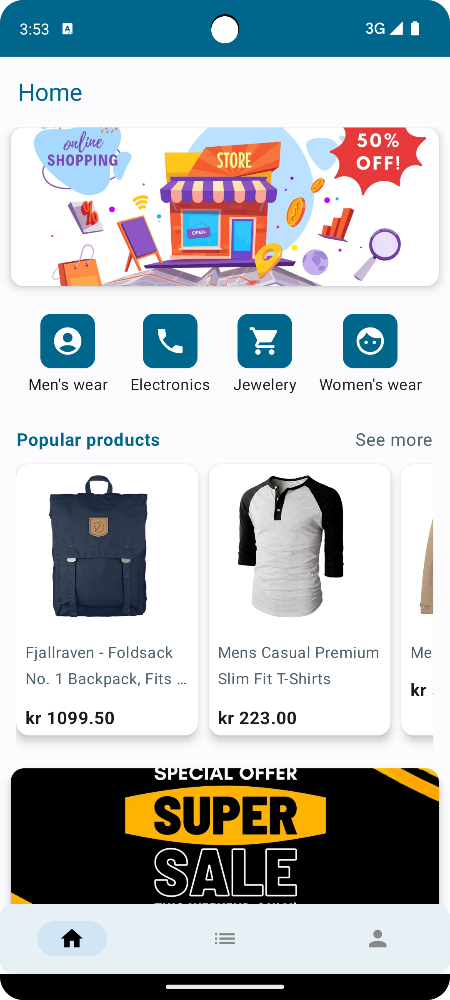

# onboarding-app [Supermarket] - Modern Android Architecture

The Supermarket App allow users to browse through products, see discounts, view their receipts, profile and more!

This project presents a modern approach to Android app development. The project tries to combine popular Android tools and to demonstrate best development practices by utilizing Jetpack Compose.

## Features

- browse through the products,
- see the discounts,
- view receipts,
- view profile

## Screens

<p>
  
  &ensp;&ensp;
   
  &ensp;&ensp;
   
  &ensp;&ensp;
</p>

* Foldable Support
<p>
  
</p>

## Description

* UI 
   * [Compose](https://developer.android.com/jetpack/compose) declarative UI framework
   * [Material design](https://material.io/design)

* Tech/Tools
    * [Kotlin](https://kotlinlang.org/) 100% coverage
    * [Coroutines](https://kotlinlang.org/docs/reference/coroutines-overview.html) for async operations
    * [Jetpack](https://developer.android.com/jetpack)
        * [Compose](https://developer.android.com/jetpack/compose) 
        * [ViewModel](https://developer.android.com/topic/libraries/architecture/viewmodel) that store/manage UI state
    * [Retrofit](https://square.github.io/retrofit/) for networking
    * [Coil](https://github.com/coil-kt/coil) for image loading
    * [Hilt](https://developer.android.com/training/dependency-injection/hilt-android) for dependency injection

## License

```
Copyright 2023 Bikramjit Singh

Licensed under bla bla bla;
you may not use this project.... just kidding use whatever way you want! 
```
